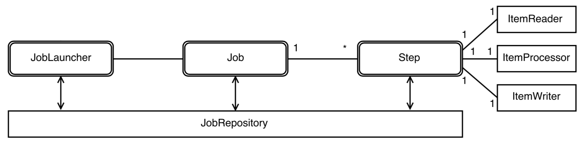

# Spring Batch #

Roadmap

* Overview Spring Batch
* Build from scratch
* Live Demo

## Batch in Spring ##

### Overview Spring Batch ###

* Spring Batch merupakan framework yang mengakomudasi proses secara batch, dengan mengeksekusi serangkaian `job`
* Job terdiri dari serangkaian step
* Step terdiri dari proses
    * Read
    * Process
    * Write
* Step juga dapat terdiri dari single operation atau istilah dalam spring batch disebut `Tasklet`
* Workflow dasar spring batch sebagai berikut



### Beberapa Istilah Spring Batch ###

1. Job : mendeskripsikan sebuah pekerjaan, misal nya membaca file *.csv dan kemudian menyimpan ke dalam database. Sebuah Job juga merupakan container dari satu atau beberapa kumpulan Step
2. Step : merupakan bagian independent yang mengandung semua informasi terkait kontrol dari proses batch. Sebuah Job terdiri dari satu atau lebih Step, misalnya Step 1 untuk membaca file *.csv dan Step 2 adalah untuk mapping nilai file kedalam database
3. JobInstance : sebuah instance yang sedang berjalan dari sebuah Job yang telah ditetapkan dalam konfigurasi. Contoh Job untuk membaca file, artinya kita memiliki 1 JobInstance dengan kata lain 1 Job yang sedang berjalan sama dengan 1 JobInstance
4. JobParameters : sekumpulan parameter yang digunakan oleh JobInstance
5. JobExecution : merupakan hasil dari menjalankan setiap JobInstance. Misal dalam membaca file *.csv, Job pertama mengalami kegagalan sedangkan berhasil setelah Job dijalankan ulang. Maka kita akan mempunyai 1 JobInstance dan memiliki 2 JobExecution (1 yang gagal, 1 yang berhasil)
6. StepExecution : memiliki arti yang sama layaknya JobExecution namun lebih mempresentasikan hasil dari sebuah Step
7. JobRepository : sebuah persistent store untuk menyimpan semua informasi meta-data sebuah Job. Repository diperlukan untuk mengetahui state dari sebuah Job, apakah mengalami kegagalan atau tidak dalam proses nya. Secara default informasi disimpan pada memory, namun dapat diseting untuk disimpan dalam database
8. JobLauncher : object yang memungkinkan kita untuk memulai sebuah Job menggunakan JobRepository untuk mendapatkan JobExecution yang valid
9. Tasklet : situasi dimana kita tidak memiliki input dan pengolahan dari output, misalnya ingin menjalankan/memanggil sebuah store procedure
10. ItemReader : sebuah abstract class yang digunakan untuk menggambarkan sebuah object yang memungkinkan kita untuk membaca sebuah object yang ingin diproses, misalnya membaca file atau membaca data dari database
11. ItemProcessor : sebuah abstract class yang digunakan untuk menghandel bisnis logic dati data yang dihasilkan oleh ItemReader sebelum dilempar ke ItemWriter
12. ItemWriter : sebuah abstract class yang digunakan untuk menulis hasil akhir dari proses batch


## Build dan Run ##

### Persiapan Database ###

* Buat database baru pada MySQL (misal : spring_batch_demo)


### Spring Boot Initializr ###

1. Browse ke [https://start.spring.io/] (https://start.spring.io/)

2. Lengkapi Project Metadata

    Group
    
    ```
    com.sheringsession.balicamp   
    ```

    Artifact
    
    ```
    spring-batch
    ```
   
    Dependencies
    
    ```
    Web, Batch, Lombok, JPA, MySQL (Optional tergantung DB yang digunakan)
    ```
   
3. Generate Project

4. Download dan import pada IDE masing-masing


### Build with Maven ###

1. Pastikan `pom.xml` terdapat dependency berikut
    
    ```java
    <dependency>
        <groupId>org.springframework.boot</groupId>
        <artifactId>spring-boot-starter-batch</artifactId>
    </dependency>
    <dependency>
        <groupId>org.springframework.boot</groupId>
        <artifactId>spring-boot-starter-data-jpa</artifactId>
    </dependency>
    <dependency>
        <groupId>org.springframework.boot</groupId>
        <artifactId>spring-boot-starter-web</artifactId>
    </dependency>

    <dependency>
        <groupId>mysql</groupId>
        <artifactId>mysql-connector-java</artifactId>
        <scope>runtime</scope>
    </dependency>
    <dependency>
        <groupId>org.projectlombok</groupId>
        <artifactId>lombok</artifactId>
        <optional>true</optional>
    </dependency>
    <dependency>
        <groupId>org.springframework.boot</groupId>
        <artifactId>spring-boot-starter-test</artifactId>
        <scope>test</scope>
    </dependency>
    ```

2. `applicatioin.properties` untuk konfigurasi database source, hibernate dll

    ```java
    # Setting datasource mysql
    spring.datasource.url=jdbc:mysql://localhost/spring_batch_demo
    spring.datasource.username=root
    spring.datasource.password=******
    spring.datasource.driver-class-name=com.mysql.jdbc.Driver

    # Hibernate properties
    spring.jpa.hibernate.ddl-auto=update
    spring.jpa.show-sql=true
    spring.jpa.properties.hibernate.format_sql=true
    ```


### Build with your IDE ###

1. Pastikan main class spring application telah menggunakan annotation `@EnableBatchProcessing`

    ```java
    @SpringBootApplication
    @EnableBatchProcessing
    public class SpringbatchDemoApplication {

        public static void main(String[] args) {
            SpringApplication.run(SpringbatchDemoApplication.class, args);
        }
    }
    ```

2. Buat Entity misal Peserta

    ```java
    @Data @Entity @Table(name="Peserta")
    public class Peserta {
        @Id @GeneratedValue(generator="uuid") @GenericGenerator(name="uuid", strategy="uuid2")
        private String id;
        private String name;
        private String alamat;
        @Temporal(TemporalType.DATE)
        private Date tanggalLahir;
    }
    ```

3. Jalankan aplikasi

    ```java
    mvn clean spring-boot:run
    ```
    Cek pada database, tabel Peserta dan entity batch persistance dengan prefix BATCH_*** otomatis akan terbentuk

4. Membuat contoh file *.csv dengan menggunakan delimiter `,` pada classpath project `src/main/resource` misal dengan nama `test-data.csv` dengan beberapa content sebagai berikut:

    ```csv
    Name1, Jl. Alamat 1, 1987-05-01
    Name2, Jl. Alamat 2, 1988-02-04
    Name3, Jl. Alamat 3, 1990-03-12
    Name4, Jl. Alamat 4, 1987-05-07
    Name5, Jl. Alamat 5, 1991-10-11
    Name6, Jl. Alamat 6, 1991-01-01
    ```

5. Menyiapkan DAO class untuk entity `Peserta` untuk keperluan persistent database

    ```java
    public interface PesertaDao extends PagingAndSortingRepository<Peserta, String>{
    }
    ```

6. Menyiapkan konfigurasi class untuk menjalankan batch proses membaca file csv dan disimpan kedalam database 

    Membuat class konfigurasi dengan beberapa instance yang diperlukan
    
    ```java
    @Configuration
    public class PesertaBatchConfig {
        @Autowired public JdbcTemplate jdbcTemplate;
        @Autowired public JobBuilderFactory jobBuilderFactory;
        @Autowired public StepBuilderFactory stepBuilderFactory;
    }
    ```

    Menyiapkan ItemReader yang bertugas untuk membaca file csv dan melakukan mapping terhadap object entity `Peserta` di dalam class konfigurasi. Untuk kebutuhan demo diperlukan ItemReader yang bertugas membaca file maka telah disediakan oleh spring `FlatFileItemReader`
    
    ```java
    @Bean
	public FlatFileItemReader<Peserta> reader() {
		FlatFileItemReader<Peserta> reader = new FlatFileItemReader<Peserta>();
		reader.setResource(new ClassPathResource("test-data.csv"));
		reader.setLineMapper(new DefaultLineMapper<Peserta>() {
			{
				setLineTokenizer(new DelimitedLineTokenizer() {
					{
						setNames(new String[] { "nama", "alamat", "tanggalLahir" });
					}
				});
				setFieldSetMapper(new PesertaMapper());
			}
		});

		return reader;
	}
    ```
    
    Untuk mapping dari file ke object entity `Peserta` diperlukan metode khusus dengan implement `org.springframework.batch.item.file.mapping.FieldSetMapper`
    
    ```java
    @Component
    public class PesertaMapper implements FieldSetMapper<Peserta>{

        @Override
        public Peserta mapFieldSet(FieldSet fs) throws BindException {
            Peserta peserta = new Peserta();
            peserta.setName(fs.readRawString(0));
            peserta.setAlamat(fs.readString("alamat"));
            peserta.setTanggalLahir(fs.readDate(2));

            return peserta;
        }
    }
    ```
    
    Setelah menyiapkan ItemReader, langkah selanjutnya menyiapkan komponen ItemProcessor dengan implement `org.springframework.batch.item.ItemProcessor`. Contoh ItemProcessor pada demo berikut melakukan proses logic untuk merubah nama peserta menjadi UpperCase
    
    ```java
    @Component
    public class PesertaItemProcessor implements ItemProcessor<Peserta, Peserta>{
        @Override
        public Peserta process(Peserta peserta) throws Exception {
            String nama = peserta.getName().toUpperCase();
            Peserta newPeserta = new Peserta();
            newPeserta.setName(nama);
            newPeserta.setAlamat(peserta.getAlamat());
            newPeserta.setTanggalLahir(peserta.getTanggalLahir());

            return newPeserta;
        }
    }
    ```

    Langkah selanjutnya adalah menyiapkan komponent ItemWriter untuk menyimpan data hasil ItemReader & ItemProcessor dengan implement `org.springframework.batch.item.ItemWriter`
    
    ```java
    @Component
    public class PesertaItemWriter implements ItemWriter<Peserta> {

        private static final Logger LOG = LoggerFactory.getLogger(PesertaItemWriter.class);

        @Autowired private PesertaDao pesertaDao;

        @Override
        public void write(List<? extends Peserta> list) throws Exception {
            for(Peserta p : list) {
                
                LOG.info("PESERTA YANG AKAN DI SAVE : {}",p.getName());
                pesertaDao.save(p);
            }
        }
    }
    ```
    
    Tambahkan pada class konfigurasi `PesertaBatchConfig` instance dari ItemProcessor dan ItemWriter
    
    ```java
    @Autowired public PesertaItemProcessor processor;
	@Autowired public PesertaItemWriter itemWriter;
    ```
    
    Tambahkan Step untuk membungkus proses read (FlatFileItemReader), process (ItemProcess) & write (ItemWriter) yang telah dibuat sebelumnya pada class konfigurasi
    
    ```java
    @Bean
	public Step importPesertaStep() {
		return stepBuilderFactory.get("step-1")
				.<Peserta, Peserta>chunk(2)
				.reader(reader())
				.processor(processor)
				.writer(itemWriter)
				.build();
	}
    ```
    
    Setelah step ditambahkan, waktunya membuat sebuah Job pada class konfigurasi
    
    ```java
    @Bean
	public Job importDataPesertaJob() {
		return jobBuilderFactory
				.get("importPesertaJob")
				.incrementer(new RunIdIncrementer())
				.flow(importPesertaStep())
				.end()
				.build();
	}
    ```
    
    Jalankan aplikasi melalui perintah berikut 
    
    ```java 
    mvn spring-boot:run
    ```
    

### Kontrol JobExecution & JobLauncher ###

Pada sesi sebelumnya, job batch akan otomatis start setiap kali menjalankan aplikasi. Untuk kontrol kapan job akan dikerjakan atau dengan kata lain dipanggil via REST maka dilakukan beberapa langkah berikut:

1. Tambahkan pada file `application.properties`, set `false` enable batch job (nilai default adalah `true`)

    ```java
    spring.batch.job.enabled=false
    ```
    
    Tujuannya adalah membuat job menjadi lazy start
    
2. Expose REST via controller class

    ```java
    @RestController
    @RequestMapping("/peserta/process")
    public class PesertaController {
        @Autowired private JobLauncher jobLauncher;
        @Autowired @Qualifier("importDataPesertaJob") private Job importDataPesertaJob;

        @GetMapping("/import")
        public String executeJob() throws JobExecutionAlreadyRunningException, JobRestartException,
                JobInstanceAlreadyCompleteException, JobParametersInvalidException {
            String status = "";
            try {
                JobExecution execution = jobLauncher.run(importDataPesertaJob, new JobParametersBuilder()
                        .addString("JobId", String.valueOf(System.currentTimeMillis()))
                        .toJobParameters());
                @SuppressWarnings("unused")
                Boolean isFailed = Boolean.FALSE;
                if (BatchStatus.FAILED.equals(execution.getStatus())) {
                    isFailed = Boolean.TRUE;
                    status = "FAILED!!!";
                } else {
                    status = "SUCCESS!!";
                }
            } catch (Exception e) {
                status = "ERROR LAUNCH importDataPesertaJob : " + e.getMessage();
            }
            return status;
        }
    }
    ```
    
3. Jalankan aplikasi dan coba panggil via rest client untuk menjalankan Job `importDataPesertaJob`
    
    ```java
    mvn spring-boot:run
    ```
    
    Panggil via rest dengan url path `localhost:8080/peserta/process/import`
    

## Fault Tolerant, Listener, Tasklet, Paralel Step, Trace Error & Conditional Flow ##

Pada sesi sebelumnya, telah diimplementasi penggunaan `Step` dan `Job` yang eksekusinya dijalankan secara sequensial dan dalam contoh normal case (tidak terdapat error/exception tertentu). Pada bagian berikut ini, akan diuraikan penggunaan toleransi kesalahan, penggunaan listener dan bagaimana menjalankan Step secara paralel.

### Fault Tolerant ###

Fault Tolerant biasanya digunakan dalam kondisi suatu proses mengalami kegagalan pada bagian tertentu, sehingga diperlukan mekanisme untuk melanjutkan proses sampai suatu job dinyatakan complete (dengan status COMPLETE atau FAILED). Kegagalan proses dapat diakibatkan oleh beberapa case tertentu, diantaranya format file yang gagal termapping, gagal menyimpan ke database ataupun berdasarkan Exception Class tertentu.
Untuk mengakomudasinya, dapat diimplementasi `.faultTolerant()` pada deklarasi Step. Dengan implementasi faultTolerant, terdapat 2 proses yang biasanya secara tipical mengikuti faultTolerent yaitu `skip` dan `retry`. Implementasi dapat dilakukan dengan menambahkan beberapa code berikut pada initialisasi Step

```java
@Bean
public Step importPesertaStep() {
    return stepBuilderFactory.get("step-1")
            .<Peserta, Peserta>chunk(2)
            .reader(reader())
            .processor(processor)
            .writer(writer)
            .faultTolerant()
                .skip(FlatFileParseException.class)
                .skip(SQLDataException.class)
                .skipLimit(2)
                .retry(SQLDataException.class)
                .retryLimit(3)
            .build();
}
```
    

### Listener ###

Listener class biasanya digunakan untuk menghandel proses skip & retry dalam faultTolerant dan untuk keperluan interceptor proses tertentu. Pada contoh berikut, listener digunakan untuk modifikasi exit status pada BATCH_STEP_EXECUTION.

```java
@Component
public class SkipChekingListener extends StepExecutionListenerSupport{

    @Override
    public ExitStatus afterStep(StepExecution stepExecution) {
        String exitCode = stepExecution.getExitStatus().getExitCode();
        if(!exitCode.equals(ExitStatus.FAILED.getExitCode()) && stepExecution.getSkipCount() > 0) {
            return new ExitStatus("COMPLETE WITH ERROR");
        }else {
            return null;
        }
    }
}
```
    
    
Penambahan Listener diimplementasi pada inisiasi Step

Autowired Class SkipChekingListener
    
```java
@Autowired public SkipChekingListener skipChekingListener;
```

Menambahkan listener pada StepBuilderFactory
    
```java
@Bean
public Step importPesertaStep() {
    return stepBuilderFactory.get("step-1")
            .<Peserta, Peserta>chunk(2)
            .reader(reader())
            .processor(processor)
            .writer(writer)
            .faultTolerant()
                .skip(FlatFileParseException.class)
                .skipLimit(2)
                .retry(FlatFileParseException.class)
                .retryLimit(2)
            .listener(skipChekingListener)
            .build();
}
```
    

### Tasklet ####

Tasklet merupakan single proses yang tidak memerlukan reader, processor maupun writer. Contoh sederhana penggunaan Tasklet dapat dengan membuat Class berikut:

Tasklet untuk Delete file 

```java
@Component
public class DeleteFileTasklet implements Tasklet{

    private static final Logger LOG = LoggerFactory.getLogger(DeleteFileTasklet.class);

    @Override
    public RepeatStatus execute(StepContribution arg0, ChunkContext arg1) throws Exception {
        File file = new ClassPathResource("test-data.csv").getFile();
        if (file.delete()) {
            LOG.info("File {} has been deleted!!!", file.getName());
        }
        else {
            LOG.error("Uneble to delete!!!");
        }
        return RepeatStatus.FINISHED;
    }
}
```

Simpel Tasklet 

```java
public class SampleTasklet implements Tasklet{

    private static final Logger LOG = LoggerFactory.getLogger(SampleTasklet.class);

    @Override
    public RepeatStatus execute(StepContribution paramStepContribution, ChunkContext paramChunkContext)
            throws Exception {
        LOG.info("## Running Tasklet {}", SampleTasklet.class);
        return null;
    }
}
```

Tasklet dalam implementasi kedalam sebuah StepBuilderFactory dapat dilihat pada contoh berikut


```java
@Bean
public Step sampleStep() {
    return stepBuilderFactory.get("step-sample")
            .tasklet(new SampleTasklet())
            .build();
}

@Bean
public Step delete() {
    return stepBuilderFactory.get("step-delete")
            .tasklet(new DeleteFileTasklet())
            .build();
}
```


### Paralel Step ###

Step pada suatu Job dapat di jalankan secara sekuensial maupun secara paralel. Untuk menjalankan Step secara paralel, maka pada JobBuilderFactory dibuatkan sebuah `Flow` terlebih dahulu. Pada JobBuilderFactory, perlu menambahkan method `split` untuk menjalankan paralel Task. Untuk penggunaan pada JobBuilderFactory dapat dilihat pada contoh berikut

    
```java
@Bean
public Job importDataPesertaJob() {
    /* Paralel Flow */
    Flow flow1 = new FlowBuilder<Flow>("subFlow-1")
            .from(delete())
            .build();

    Flow flow2 = new FlowBuilder<Flow>("subFlow-2")
            .from(sampleStep())
            .build();

    return jobBuilderFactory
            .get("importPesertaJob")
            .incrementer(new RunIdIncrementer())
            .flow(importPesertaStep())
            .split(new SimpleAsyncTaskExecutor())
            .add(flow1, flow2)
            .end()
            .build();
}
```

### Trace Skip Error ###

Untuk mengetahui error skip berada pada jumlah proses keberapa, dapat diintercept menggunakan `org.springframework.batch.core.annotation.OnReadError`. Cara sederhananya, membuat satu class baru dan Overide annotation `@OnReadError` atau `@OnSkipInRead` untuk mengetahui file dan line yang terlewati.

```java
@Component
public class CustomSkipListener {

    private static final Logger LOG = LoggerFactory.getLogger(CustomSkipListener.class);

    @OnSkipInRead
	public void onSkipInRead(Throwable t) {
		LOG.error("INTERPT ON SKIP IN READER : {}", t.getMessage());
	}
    
    @OnReadError
    public void onReadError(Exception e) {
        LOG.error("INTERCEPTOR KETIKA ADA YANG ERROR {}", e);
    }
}
```
    
Pada konfigurasi batch proses ditambahkan listener saat inisiasi Step dengan autowired class CustomSkipListener diatas

```java
@Autowired public CustomSkipListener customSkipListener;

. . .

@Bean
public Step importPesertaStep() {
    return stepBuilderFactory.get("step-1")
            .<Peserta, Peserta>chunk(2)
            .reader(reader())
            .processor(processor)
            .writer(writer)
            .faultTolerant()
                .skip(FlatFileParseException.class)
                .skip(SQLDataException.class)
                .skipLimit(2)
                .retry(FlatFileParseException.class)
                .retryLimit(2)
            .listener(skipCheckingListener)
            .listener(customSkipListener)
            .build();
}
```


### Conditional Flow ###

Conditional Flow dapat diimplementasi sesuai kebutuhan dan berdasarkan bisnis logic dari proses batch. Pada langkah berikut, akan diimplementasikan dengan membuat satu Tasklet Class dan melakukan conditional pada JobBuilderFactory.

Langkah pertama adalah membuat Tasklet Class

```java
@Component
public class ConditionalTasklet implements Tasklet{

	private static final Logger LOG = LoggerFactory.getLogger(ConditionalTasklet.class);
	
	@Override
	public RepeatStatus execute(StepContribution contribution, ChunkContext chunkContext) throws Exception {
		LOG.info("## Menjalankan conditional tasklet {}", ConditionalTasklet.class);
		return RepeatStatus.FINISHED;
	}
}
```

Berikutnya, membuat `conditionalStep` dan melakukan perubahan pada class konfigurasi batch dengan menambahkan conditional flow sebagai berikut

```java
/* Conditional Step */
@Bean
public Step conditionalStep() {
    return stepBuilderFactory.get("step-conditional")
            .tasklet(new ConditionalTasklet())
            .build();
}

@Bean
public Job importDataPesertaJob() {

    /* Paralel Flow *
    /*Flow flow1 = new FlowBuilder<Flow>("subFlow-1")
            .from(delete())
            .build();

    Flow flow2 = new FlowBuilder<Flow>("subFlow-2")
            .from(sampleStep())
            .build();

    return jobBuilderFactory
            .get("importPesertaJob")
            .incrementer(new RunIdIncrementer())
            .flow(importPesertaStep())
            .split(new SimpleAsyncTaskExecutor())
            .add(flow1, flow2)
            .end()
            .build();
    */
            
    return jobBuilderFactory
            .get("importPesertaJob")
            .incrementer(new RunIdIncrementer())
            .flow(importPesertaStep())
                .on("COMPLETE WITH ERROR") // penambahan kondisi ketika exit code 'COMPLETE WITH ERROR'
                .to(conditionalStep()) // dilanjutkan ke conditionalStep
                .next(deleteFileStep())
            .from(importPesertaStep())
                .on("*") // semua kondisi yang terpenuhi, selain kondisi sebelumnya
                .end()
            .end()
            .build();
}
```

Penambahan kondisi pada job diatas menggunakan pattern berdasarkan exit status (secara default jika diset `"*"` artinya setiap flow yang memenuhi exit status `COMPLETE`)

## Scheduling JobLauncher ##

Selain menggunakan REST sebagai trigger sebuah job dijalankan, dapat pula menggunakan scheduler untuk pemrosesan batch. Langkah-langkah untuk menjalankan sebuah JobLauncher via scheduler adalah sebagai berikut

1. Pada main class spring boot application, ditambahkan annotasi `@EnableScheduling` 

    ```java
    @SpringBootApplication
    @EnableBatchProcessing
    @EnableScheduling // Dengan annotasi tersebut, pada clas konfigurasi kita dapat dengan mudah membuat sebuah trigger job secara schedule
    public class SpringbatchDemoApplication {

        public static void main(String[] args) {
            SpringApplication.run(SpringbatchDemoApplication.class, args);
        }
    }
    ```


2. Pada class konfigurasi batch proses, dibuat sebuah method public dengan annotasi `@Scheduled`. Sebagai contoh, misalnya ingin menjalankan batch Job dengan kurun waktu tertentu (1 menit) maka method nya adalah sebagai berikut

    Autowired jobLauncher terlebih dahulu
    ```java
    @Autowired public JobLauncher jobLauncher;
    ```
    
    Kemudian membuat method dengan annotasi `@Scheduled` dengan cron expression. 

    ```java
    @Scheduled(cron = "*/10 * * * * *")
    public void performJob() {
        try {
            LOG.info("## Job Running at {} ##", new Date());
            JobParameters jParam = new JobParametersBuilder()
                    .addString("jobId", String.valueOf(System.currentTimeMillis()))
                    .toJobParameters();
            JobExecution execution = jobLauncher.run(importPesertaJob(), jParam);
        } catch (Exception e) {
            LOG.error("Error while execute job {}", e.getMessage());
        }
    }
    ```

    Cron expression dapat digenerate secara online melalui tautan berikut: [cronmaker] (http://www.cronmaker.com/)

3. Jalankan spring boot application dan pantau dalam 1 menit, maka Job `importPesertaJob` akan otomatis dijalankan